# Exploratory Data Analysis: Singapore Total Live Births and Total Fertility Rate (1960–2024)

**GitHub Repository:** https://github.com/perryx05/Time-Series-Analysis

---

## 1. Introduction and Research Questions

Singapore has experienced a significant demographic transition sinc gaining independence, going from a high-fertility rated country in the 1960s to having one of the lowest fertility rates in the world by the 2000s. Understanding the trends in Total Live Births (TLB) and Total Fertility Rate (TFR) is important for demographic forecasting and policy evaluation.

This EDA investigates the following research questions:

1. **What are the key temporal trends and structural changes in Singapore's TLB and TFR from 1960 to 2024?**
2. **Which time series models are most appropriate for forecasting TLB and TFR beyond the training period (1960–2012)?**
3. **To what extent do known social and policy events explain the observed patterns in TLB and TFR?**

---

## 2. Data Description

**Source:** Singapore Department of Statistics (singstat.gov.sg)  
**Variables of interest:**
- **Total Live Births (TLB):** Annual count of live births in Singapore
- **Total Fertility Rate (TFR):** Average number of children a woman would have over her lifetime, based on current age-specific fertility rates

**Period:** 1960 to 2024 (65 annual observations)  
**Frequency:** Annual (no seasonality)  
**Split:** Training set 1960–2012 (53 observations); test set 2013–2024 (12 observations)

### 2.1 Data Limitations

- Annual aggregation cannot highlight the intra-year variation.
- TFR is a period measure and does not directly reflect completed fertility of any cohort.
- **Coverage definition (SingStat):** TFR before 1980 refers to the **total population**; from 1980 onward it refers to the **resident population** (citizens and permanent residents). Long-run comparisons should be considered with that constraints.
- Policy interventions and external shocks (e.g., economic recessions, COVID-19) create structural breaks that standard time series models may not capture well.
- No missing values were identified in the dataset.

---

## 3. Data Cleaning

The raw data was downloaded from singstat.gov.sg and saved as a CSV file. The following cleaning steps were applied:

1. Extracted only the two required series from the SingStat wide-format export: `Total Live-Births (Number)` and `Total Fertility Rate (TFR) (Per Female)`.
2. Reshaped from wide year-columns format into a tidy table with only 3 columns `Year`, `TLB`, `TFR`.
3. Removed comma formatting from TLB values and converted both series to numeric.
4. Verified no missing values were present in either series.
5. Confirmed 65 rows and plausible value ranges:
   - TLB: 33,541 to 61,775
   - TFR: 0.97 to 5.76
6. Saved cleaned data as `cleaned_tlb_tfr_1960_2024.csv` for use in later sections.
7. Created annual time series objects (`tlb_ts`, `tfr_ts`) and the required training/test splits:
   - Training: 1960–2012
   - Test: 2013–2024

---

## 4. Visualisation and Temporal Features

### 4.1 Overview panel

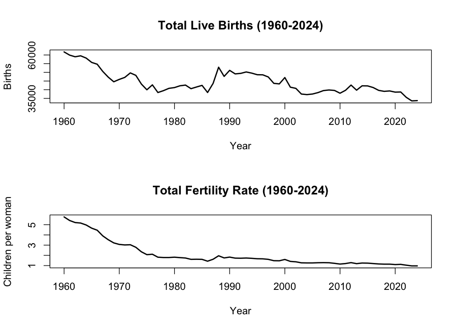

Looking at the two graphs together we can have a good starting point for understanding the data. The Total Live Births (TLB) number tends to move up and down quite a lot from year to year. It drops quite sharply from the early 1960s, then there is a noticeable increase around the late 1980s, and after the 2000s it stays at a generally lower level. There is also a clear fall happening around 2020 to 2022. For the Total Fertility Rate (TFR), the overall pattern looks similar, but the line is much smoother compared to TLB. This makes sense because TFR is calculated from age-specific birth rates, so it does not get affected by the total population size in the same way as the raw birth count does. Since this data is recorded every year, there is no seasonal pattern to observe. The main thing we can see is the long-term downward trend, with some short periods where the numbers went slightly higher or lower than expected.

### 4.2 Total Live Births (1960–2024)

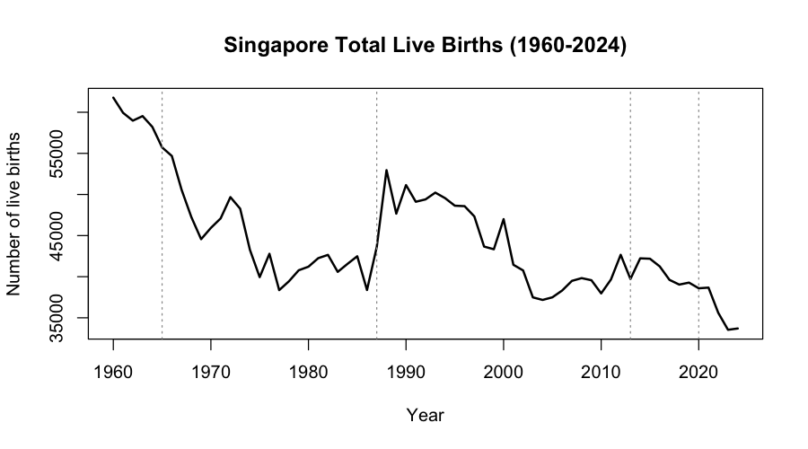

- **Early 1960s:** TLB was high (about 61,000 in 1960),but then it dropped quite sharply through the late 1960s and 1970s. This may be connected to the intensive goverment policy and social change to reduce birth after independence. For example, the Singapore Family Planning and Population Board was established in 1966 as part of a national programme to control population growth (OBGyn Key n.d.).
- **Late 1980s:** The number of births was slightly increased, which could be related to the change in government message at that time. Specifically, the **"Have Three or More if You Can Afford It"** campaign was announced in 1987 (National Library Board Singapore 2000). But this increase did not last long and the number did not go back to the same level as the 1960s.
- **1990s–2010s:** The births continued to slowly go down, but with some up and down movement along the way. This is likely due to several reasons happening at the same time — such as people getting married later, more women working, and the high cost of housing and childcare — rather than just one simple cause
- **From 2013:** The dotted vertical line around 2013 marks the beginning of the period used to test how well the forecasting model performs, which covers 2013 to 2024. The birth numbers remains quite low; 2020 is marked as a year when external shocks (COVID-19) may have affected when babies were born and when births were officially recorded.

For time series modelling, the figure suggests that treating TLB as **non-stationary** (clear level shift and trend) rather than fluctuating around a fixed mean.

### 4.3 Total Fertility Rate (1960–2024)

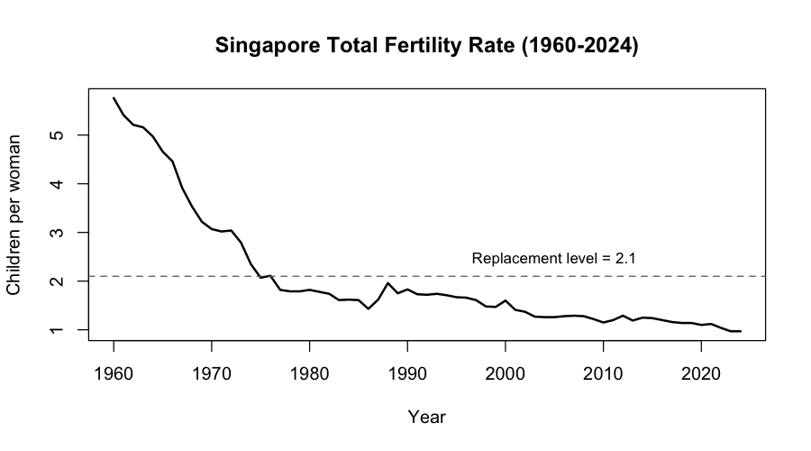

TFR starts near **5.8** in 1960 and drops below **2** by the mid-1970s. The horizontal dashed line at **2.1** which is **replacement-level fertility** (a standard demographic benchmark; see United Nations Statistics Division n.d.). Singapore’s TFR has remained below that line for many decades, reaching roughly **1.0** in recent years, which is considered extremely low and is a major concern for the government when thinking about whether the population can replace itself naturally.

Because SingStat notes a **change in population coverage** for TFR in **1980** (total population before 1980; resident population from 1980 onward), the level around 1979–1981 should be interpreted cautiously when arguing about precise “breaks”. However, this technical detail does not really change the overall picture — it is still very clear from the graph that Singapore's fertility rate collapsed dramatically over this period.
### 4.4 TLB and TFR on one figure (dual vertical axis)

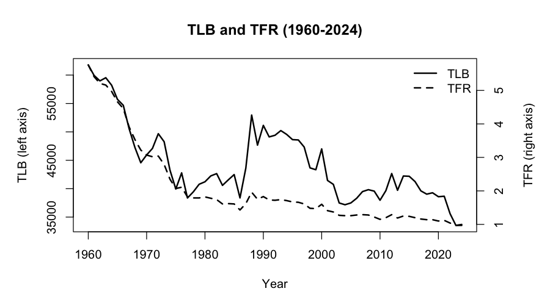

This plot is not for reading exact numbers between two measurements (births vs. rate). It is useful to see **how the two lines move together over time**: both series decline together in the first two decades; both show a small increase in the late 1980; both end up at low levels in the 2000s and 2010s. However, there are some short periods where the total live births line moves more sharply up or down compared to the TFR line. This can happen because TLB is also affected by things like how many women of childbearing age are in the population at a given time, or changes due to migration — not just whether women are choosing to have more or fewer children. This is one of the reasons why it makes more sense to model TLB and TFR as two separate series, rather than assuming that one is simply a scaled-up or scaled-down version of the other.
### 4.5 Training vs test split (modelling design)

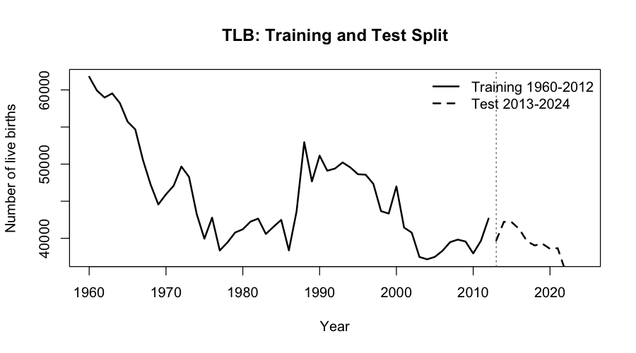

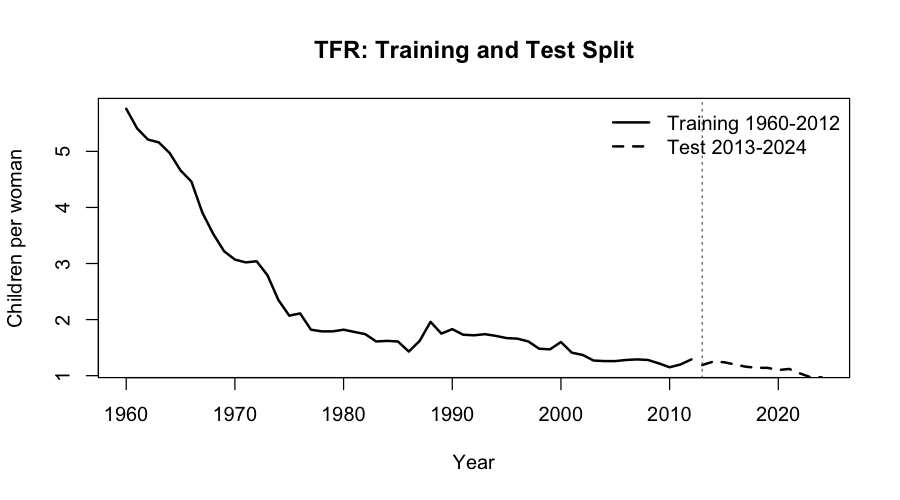

The data is divided into two parts. The first part, from **1960 to 2012 (53 years)**, is used to train the models, while the second part, from **2013 to 2024 (12 years**)**, is used to test how good the models can forecast. In each graph, the solid line represents the training period and the dashed line represents the test period, with a vertical marker showing where the split happens at 2013.

For the **Total Live Births**, the training period covers the most significant drops in birth numbers as well as the small increase in the late 1980s. The test period, on the other hand, includes the fall in births that happened around the COVID-19 period and some recovery afterwards. For the Total Fertility Rate, the test period stays within a quite narrow and very low range of roughly 1.0 to 1.3 children per woman. This means the models, which were only trained on data before 2013, need to make predictions for a period where fertility is already extremely low — quite far from where it started in the 1960s.

### 4.6 Trend smoothing and what we do *not* use (STL / seasonal decomposition)

For annual data there is no seasonal period within the year: `frequency = 1`, so STL decomposition and classical seasonal decomposition are not appropriate — they require a seasonal cycle (e.g. monthly s=12, quarterly s=4). 

Our approach is using **centred moving average** approximates a **smooth trend**; what is left over when comparing the annual series to that trend is informal irregular variation.

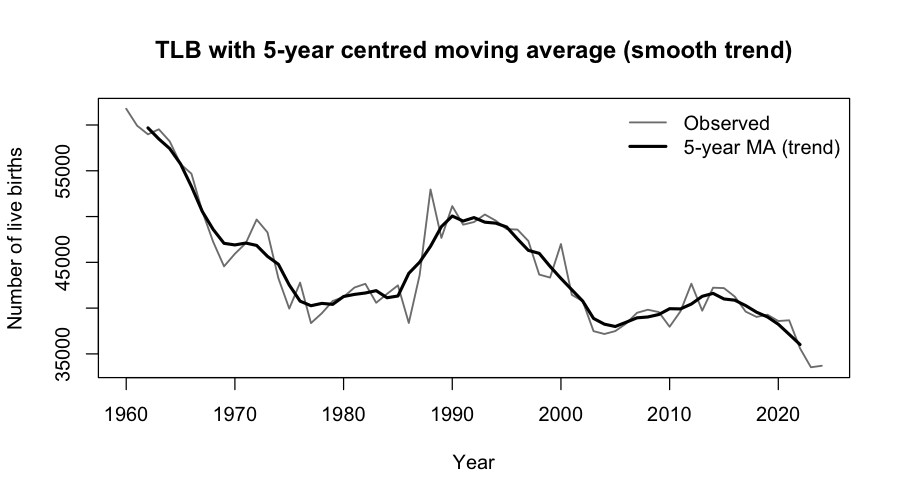

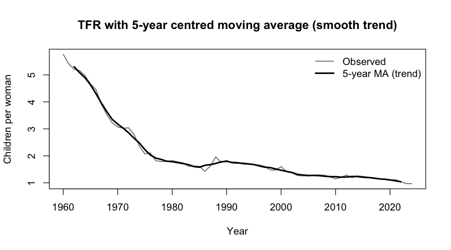

**Why a 5-year window.** A 5-year centred moving average was selected over shorter or longer windows. A 3-year MA retains too much of the short-term ups and downs in the data, while a 7-year MA over-smooths and ends up hiding some important changes in the mid-1970s and late 1980s. The 5-year window also aligns with Singapore's governmental planning cycles, providing a substantively meaningful smoothing interval. Another practical reason for using a 5-year odd-ordered centred moving average is that it does not require an extra re-centring step, which would be needed if an even-numbered window was used instead

---

## 5. Analysis of Time Series Features

Following the workflow, all analytics in this section use **training data only (1960–2012)**: **raw** ACF/PACF, then **first differences** (annual change—each year minus the year before), then ACF/PACF of the differenced series. This is exploratory description of autocorrelation only. 

### 5.1 ACF and PACF (raw) and first differences

**Raw series**

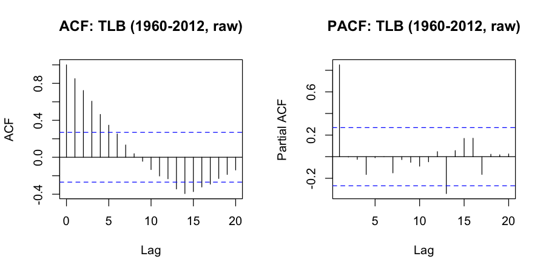

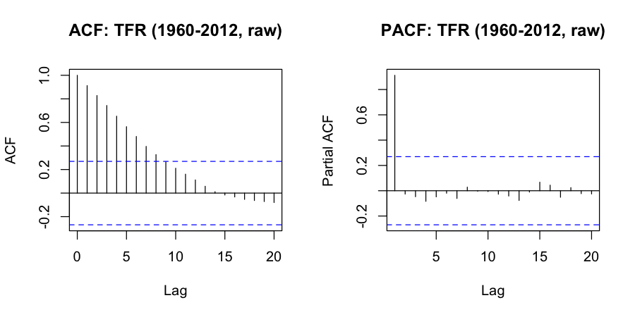

For both **TLB** and **TFR** **ACF** plot, the bars stay quite high and drop down very slowly across many lags. This kind of pattern usually means the data has a strong memory — values from many years ago are still closely related to values today. This is a clear sign that both series are non-stationary, meaning they do not fluctuate around a fixed average but instead follow a long-running downward trend over time, which is consistent with what is sometimes called unit-root or near unit-root behaviour. The PACF patterns are not the useful tool until after differencing; trying to read it as a simple low-order autoregressive pattern on the original untransformed data would not give a meaningful or reliable result.

**First differences (illustrative series)**

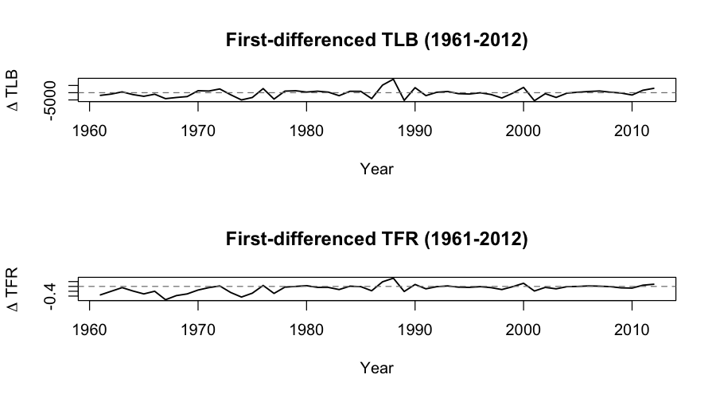

After applying first differencing, both series now fluctuate around zero without any clear upward or downward drift. This means the data is now showing the year-to-year change — how much the number of births or the fertility rate went up or down compared to the previous year — rather than the overall level. This transformed version of the data is more suitable for modelling because it captures the accumulated effect of short-term shocks and the influence of different policy phases over time.

**ACF/PACF after differencing**

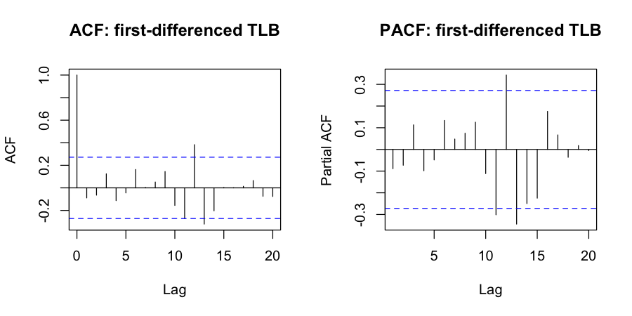

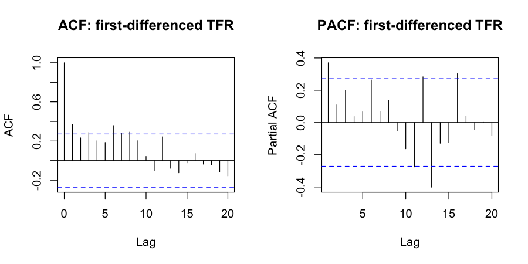

After **one difference**, the correlations die off much faster compared to the original series. This is what we want because AR / MA / ARMA models assume the series is roughly stationary around a stable mean.

For **TLB (annual change)**, the ACF and PACF at short lags (1–3) are mostly inside the confidence bands. This suggests the year-to-year change in births does not have a strong and stable autocorrelation pattern. A reasonable and very parsimonious first candidate is **ARMA(0,0)** for the differenced series (meaning the changes are close to white noise plus an average drift).

For **TFR (annual change)**, the PACF shows a clear spike at lag 1 while the ACF drops quickly. This pattern is often consistent with an **AR(1)** structure on the differenced series, so a sensible first candidate is **AR(1)** for the annual changes in TFR. Some later lags show spikes too, but because the sample after differencing is only 52 points and fertility has structural breaks, we start with a simple low-order model and rely on residual checks to see if the model is acceptable.

### 5.2 Stationarity tests 

Tests are run in **R** (`tseries` package) with default settings. **Augmented Dickey–Fuller (ADF):** H₀ = **unit root** (non-stationary); **rejection** of H₀ (small p-value, typically compared to α = 0.05) supports **stationarity**.

**Justification of the formula used above (first difference).** In `Δy_t = y_t - y_{t-1}`, `y_t` means the series value in year `t`, `y_{t-1}` means previous year value, and `Δy_t` is the year-to-year change (annual change). We use it because the level series has strong trend, and AR/MA/ARMA needs a more stable series.

| Series | ADF p-value | Interpretation (α = 0.05) |
|--------|-------------|---------------------------|
| TLB (raw) | 0.356 | Do not reject H₀ → **no evidence against a unit root**; level treated as **non-stationary**. |
| TFR (raw) | 0.120 | Do not reject H₀ → **non-stationary** level (not significant at 5%). |
| TLB, first difference | 0.039 | Reject H₀ → **stationary** differenced series. |
| TFR, first difference | 0.083 | Do **not** reject H₀ at 5% (borderline); **inconclusive**—unit root not ruled out strongly. |

**Summary.** ADF on the raw series suggests both TLB and TFR are non-stationary in levels (they have strong trend / long memory). After one difference (annual change, `Δy_t = y_t - y_{t-1}`), **TLB** clearly becomes stationary by ADF at 5%. For **TFR**, the differenced ADF result is borderline at 5%, which is not unusual for short annual series with policy breaks. In this EDA we still proceed with modelling the annual changes using simple AR / MA / ARMA candidates, and we check if residuals look like white noise.

---

## 6. Preliminary Model Identification (training: 1960–2012)

For each candidate model below, we report:
- AIC and BIC (in-sample fit with complexity penalty)
- residual ACF/PACF (should look like white noise)
- Box–Ljung test on residuals (lag 10)

**Justification of terms (AIC/BIC and Box–Ljung).**  
- **AIC/BIC** are model selection criteria from the fitted likelihood. Lower values mean better fit after penalty for number of parameters. BIC penalises complexity stronger than AIC, so BIC often prefers simpler model.  
- **Box–Ljung** tests whether residual autocorrelations are jointly close to zero up to a chosen lag (here lag 10). A large p-value means residuals are consistent with white noise, which is what we want after fitting a good model.

### 6.1 TLB candidate: ARMA(0,0) on annual changes

**Model form.** We fit ARMA(0,0) on `diff(TLB_train)`. This is the simplest baseline: it assumes the annual change is mainly random noise around a mean drift.

**Why this is reasonable.** The differenced ACF/PACF for TLB do not show clear and stable short-lag spikes, so adding AR or MA terms may not improve much in a reliable way. Starting with the simplest model helps us to avoid overfitting.

- **AIC / BIC (training):** AIC = **975.13**, BIC = **979.03**

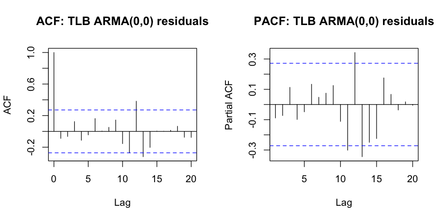

- **Box–Ljung (lag 10):** p-value = **0.707** → do not reject white-noise residuals at 5%.

**Conclusion.** ARMA(0,0) is a viable preliminary candidate for TLB annual changes. In the Final Report we will compare it with at least one more flexible model (e.g. AR(1) or ARMA(1,1)) and decide based on forecast performance on 2013–2024.

### 6.2 TFR candidate: AR(1) on annual changes

**Model form.** We fit AR(1) on `diff(TFR_train)`. This means the current year change is partly related to the previous year change.

**Why this is reasonable.** In the differenced TFR PACF there is a clear spike at lag 1, while the ACF drops quickly. This is a standard visual pattern that supports an AR(1) structure.

- **AIC / BIC (training):** AIC = **−45.86**, BIC = **−40.01**

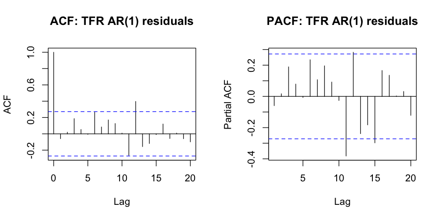

- **Box–Ljung (lag 10):** p-value = **0.439** → do not reject white-noise residuals at 5%.

**Conclusion.** AR(1) on annual changes is a viable preliminary candidate for TFR. In the Final Report we will still compare it with at least one alternative ARMA model because fertility has structural breaks and the ADF result is borderline after differencing.

---

## 7. Model Assessment Strategy

For the Final Report, where at least two models per series are required and forecasts for 2013–2024 are needed, the model comparison will use both in-sample and out-of-sample criteria.

**In-sample (training fit, 1960–2012):**
- AIC and BIC — penalise model complexity; lower is better.
- Residual diagnostics — ACF/PACF of residuals should resemble white noise; Box-Ljung test p-value should be > 0.05.

**Out-of-sample (forecast accuracy, 2013–2024):**
- Root Mean Squared Error (RMSE) — penalises large errors.
- Mean Absolute Error (MAE) — robust to outliers.
- Mean Absolute Percentage Error (MAPE) — allows comparison across TLB and TFR scales.
- Visual inspection of forecast vs actual plot — important for assessing direction and structural plausibility.

**Trade-offs.** AIC can prefer more complex models, while BIC penalises complexity more strongly and often prefers simpler models in moderate samples like 53 years. A good in-sample fit may still overfit the historical period (especially with structural breaks). Because of this, the Final Report will prioritise **out-of-sample RMSE** on 2013–2024, supported by MAE/MAPE and residual checks.

---

## 8. Brief Literature Review

This EDA uses basic AR/MA/ARMA tools, but it is still useful to look at what is common in the literature for birth and fertility forecasting:

- **Land & Cantor (1983, Demography)** modelled birth and death rates using ARIMA-style time-series methods and discussed how autocorrelation patterns help with model building. This supports the idea that autocorrelation diagnostics are important even for demographic outcomes.
- **de Beer (1989)** discussed time-series approaches for projecting fertility rates (including age-specific fertility) and shows that demographic time series often need careful handling of trend and structural change.
- A recent example is a study on India TFR which compared Holt’s trend method with ARIMA and found ARIMA had smaller forecast errors in that setting (see “A comparative analysis of the Holt and ARIMA models for predicting the future total fertility rate in India”, *Life Cycle Reliability and Safety Engineering*, 2025; published online 03 January 2025: `https://link.springer.com/article/10.1007/s41872-024-00287-1`). This suggests that time-series models can be useful, but results depend on the country context and the stability of policy and social conditions.

Overall, the literature suggests that simple time-series models can work for short horizons, but long-run fertility decline is influenced by structural factors. This is why the Final Report should combine statistical criteria with contextual knowledge.

---

## 9. References (course + context)

- OBGyn Key n.d., *Singapore's pro-natalist policies: to what extent have they worked?*, OBGyn Key, viewed 29 March 2026, `https://obgynkey.com/singapores-pro-natalist-policies-to-what-extent-have-they-worked/`.
- National Library Board Singapore 2000, *“Have three, or more if you can afford it” is announced*, NLB Singapore, viewed 29 March 2026, `https://www.nlb.gov.sg/main/article-detail?cmsuuid=1d106f7e-aca1-4c0e-ac7a-d35d0772707d`.
- United Nations Statistics Division n.d., *Total Fertility Rate: Demographics — Population Change*, UN Statistics Division, viewed 29 March 2026, `https://www.un.org/esa/sustdev/natlinfo/indicators/methodology_sheets/demographics/total_fertility_rate.pdf`.

