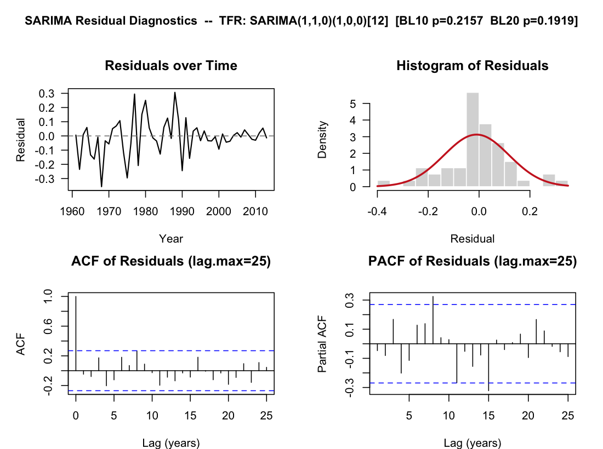
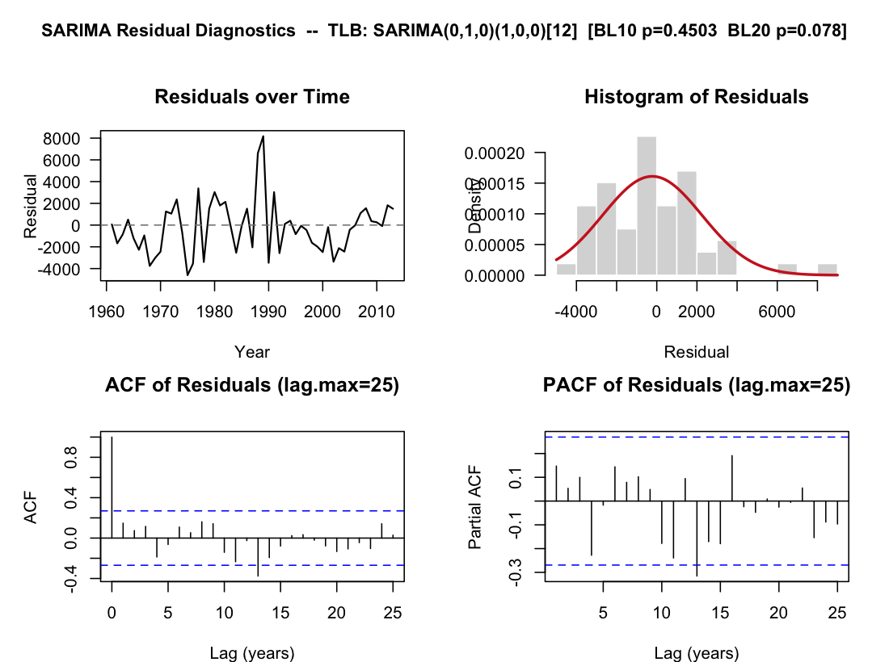
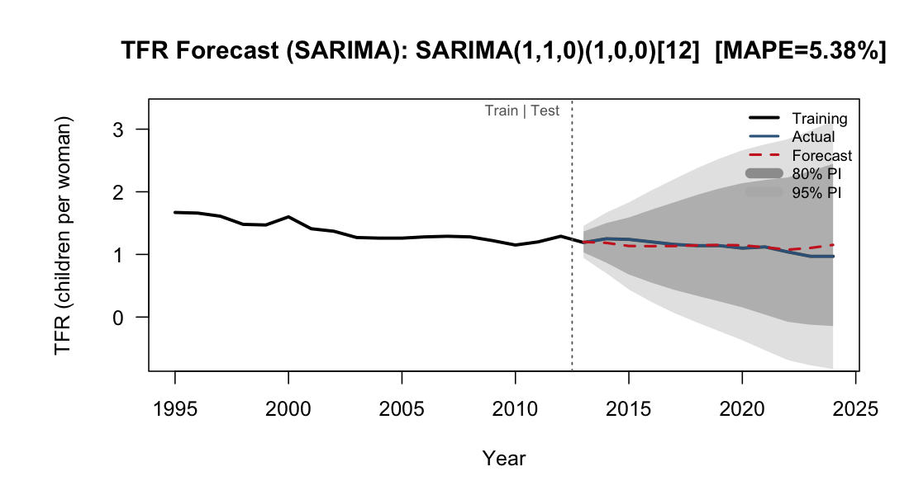
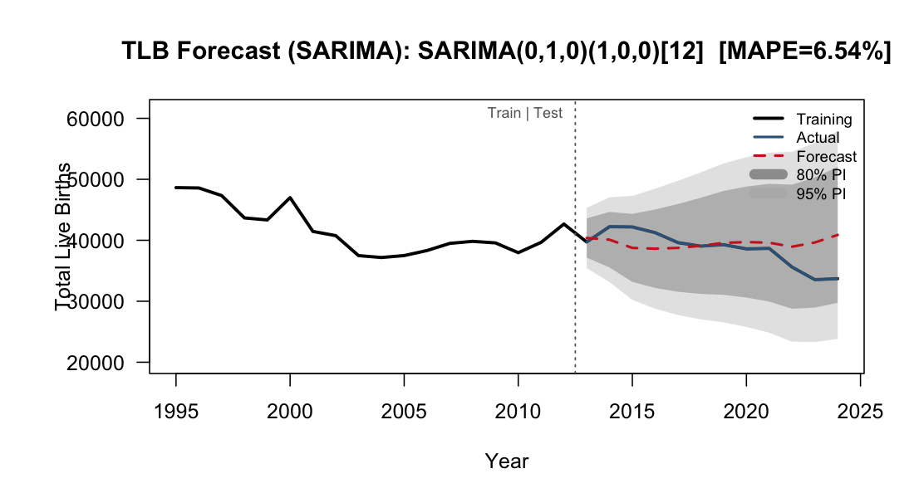

# Methods & Results Draft — Singapore TFR/TLB

## Part 1: Methods — Stationarity and Model Identification

---

### Figure 1 — Raw TFR Series (1960–2024)

Singapore's TFR collapsed from 5.76 children per woman in 1960 to 0.97 in 2023, a decline of nearly 5 full children per woman over six decades driven by industrialisation, urbanisation, and explicit government population policy. The series crossed below the replacement level of 2.1 in approximately 1976 and has never returned — by the mid-1980s TFR was already below 1.7, making any mean-reversion assumption untenable. This persistent, monotone decline with no tendency to return to a stable mean is the defining visual signature of a non-stationary process, and it directly motivates the ADF test reported in Table 1.

---

### Figure 3 — First-Differenced TLB and TFR (Fixed Vertical Scale)

After one round of differencing, both series fluctuate around zero with no systematic upward or downward drift, confirming that d = 1 is the appropriate differencing order. The expanded y-axis (TLB: ±10 000 births/year; TFR: ±0.6 children/woman) makes the true magnitude of year-to-year shocks visible: for TLB, the "Have Three or More" campaign produced a +5 237 birth jump in 1987 and a further surge to +9 341 in 1988, while the 2003 dip (−3 275) reflects post-SARS effects. For ΔTFR, the largest annual fall was −0.55 in 1967 with a partial recovery of +0.34 in 1988. One differencing is clearly sufficient for TLB (ADF p = 0.040); the ADF result for ΔTFR is borderline (p = 0.083), but given the strong visual evidence of stationarity and the risk of over-differencing, d = 1 is adopted for both series.

---

### Figure 4a — ACF and PACF of First-Differenced TFR (lag.max = 25)

### Figure 4b — ACF and PACF of First-Differenced TLB (lag.max = 25)

---

### Table 1 — ADF Stationarity Test Results

Augmented Dickey-Fuller tests (H₀: unit root; alternative: stationary). Training period only (1960–2012 raw; 1961–2012 differenced).

| Series               | ADF statistic |  p-value  | Conclusion                                          |
| -------------------- | :-----------: | :-------: | --------------------------------------------------- |
| TFR, raw (1960–2012) |    −3.129     |   0.120   | Non-stationary — fail to reject H₀ at 5%            |
| TLB, raw (1960–2012) |    −2.543     |   0.356   | Non-stationary — fail to reject H₀ at 5%            |
| ΔTFR (1961–2012)     |    −3.288     |   0.083   | Borderline — fail to reject H₀ at 5%; reject at 10% |
| **ΔTLB (1961–2012)** |  **−3.625**   | **0.040** | **Stationary — reject H₀ at 5%**                    |

First-differencing clearly renders TLB stationary. The ADF result for ΔTFR is borderline (p = 0.083); we proceed with d = 1 for TFR based on the visual evidence in Figure 3 (no drift) and to avoid over-differencing.

---

### Table 2 — Candidate Model Comparison (ARIMA and SARIMA)

All models fitted with `Arima()` (forecast package) on the **raw training series**. For SARIMA, `seasonal = list(order = c(P, 0, Q), period = 12)` with `frequency = 1` (annual data) — `period = 12` targets the 12-year zodiac lag identified in Figures 4a and 4b. **Selection rule:** lowest AIC among models with Box-Ljung p > 0.05 at lag 10 (BL10). BL20 is reported as an additional diagnostic.

#### TFR — 12 Candidates

| Model                        | Params |        AIC |        BIC |  BL10 p   |  BL20 p   | Viable? | Selected |
| ---------------------------- | :----: | ---------: | ---------: | :-------: | :-------: | :-----: | :------: |
| ARIMA(1,1,0)                 |   1    |     −42.73 |     −38.83 |   0.473   |   0.011   |   Yes   |          |
| ARIMA(2,1,0)                 |   2    |     −42.85 |     −37.00 |   0.433   |   0.018   |   Yes   |          |
| ARIMA(6,1,0)                 |   6    |     −44.26 |     −30.60 |   0.575   |   0.024   |   Yes   |          |
| ARIMA(1,1,1)                 |   2    |     −48.90 |     −43.04 |   0.452   |   0.057   |   Yes   |          |
| ARIMA(6,1,1)                 |   7    |     −44.72 |     −29.11 |   0.890   |   0.043   |   Yes   |          |
| SARIMA(0,1,0)(1,0,0)[12]     |   1    |     −34.94 |     −31.04 |  < 0.001  |  < 0.001  | **No**  |          |
| SARIMA(0,1,1)(1,0,0)[12]     |   2    |     −51.46 |     −45.60 |   0.060   |   0.012   |   Yes   |          |
| SARIMA(1,1,0)(0,0,1)[12]     |   2    |     −51.21 |     −45.35 |   0.383   |   0.203   |   Yes   |          |
| SARIMA(1,1,1)(1,0,0)[12]     |   3    |     −53.90 |     −46.10 |   0.138   |   0.103   |   Yes   |          |
| SARIMA(1,1,0)(1,0,1)[12]     |   3    |     −54.51 |     −46.70 |   0.276   |   0.336   |   Yes   |          |
| SARIMA(2,1,0)(1,0,0)[12]     |   3    |     −53.78 |     −45.97 |   0.179   |   0.150   |   Yes   |          |
| **SARIMA(1,1,0)(1,0,0)[12]** | **2**  | **−55.63** | **−49.78** | **0.216** | **0.192** | **Yes** |  **✓**   |

All 5 standard ARIMA models fail BL20 (p ≤ 0.057), confirming the lag-12 seasonal structure must be explicitly modelled.

#### TLB — 12 Candidates

| Model                        | Params |        AIC |        BIC |  BL10 p   |  BL20 p   | Viable? | Selected |
| ---------------------------- | :----: | ---------: | ---------: | :-------: | :-------: | :-----: | :------: |
| ARIMA(0,1,0)                 |   0    |     974.05 |     976.00 |   0.702   |   0.020   |   Yes   |          |
| ARIMA(1,1,0)                 |   1    |     975.81 |     979.71 |   0.749   |   0.034   |   Yes   |          |
| ARIMA(2,1,0)                 |   2    |     977.68 |     983.53 |   0.847   |   0.049   |   Yes   |          |
| ARIMA(6,1,0)                 |   6    |     983.20 |     996.86 |   0.956   |   0.068   |   Yes   |          |
| ARIMA(1,1,1)                 |   2    |     978.03 |     983.88 |   0.709   |   0.021   |   Yes   |          |
| SARIMA(1,1,0)(0,0,1)[12]     |   2    |     970.86 |     976.72 |   0.658   |   0.121   |   Yes   |          |
| SARIMA(2,1,0)(1,0,0)[12]     |   3    |     969.18 |     976.98 |   0.394   |   0.225   |   Yes   |          |
| SARIMA(0,1,1)(1,0,0)[12]     |   2    |     967.64 |     973.49 |   0.528   |   0.210   |   Yes   |          |
| SARIMA(1,1,0)(1,0,0)[12]     |   2    |     967.43 |     973.29 |   0.480   |   0.233   |   Yes   |          |
| SARIMA(1,1,1)(1,0,0)[12]     |   3    |     969.16 |     976.96 |   0.407   |   0.220   |   Yes   |          |
| SARIMA(1,1,0)(1,0,1)[12]     |   3    |     968.53 |     976.34 |   0.642   |   0.331   |   Yes   |          |
| **SARIMA(0,1,0)(1,0,0)[12]** | **1**  | **966.97** | **970.87** | **0.450** | **0.078** | **Yes** |  **✓**   |

All standard ARIMA models fail BL20 (p = 0.020–0.068).

---

## Part 2: Results — Selected Model Diagnostics and Forecasts

---

### Figure 5a — Residual Diagnostics: TFR [SARIMA(1,1,0)(1,0,0)[12]]

The SARIMA(1,1,0)(1,0,0)[12] residuals give BL10 p = 0.216 and BL20 p = 0.192 — both well above 0.05. The residual ACF shows no significant bars at lags 11, 12, or 13.

### Figure 5b — Residual Diagnostics: TLB [SARIMA(0,1,0)(1,0,0)[12]]

The SARIMA(0,1,0)(1,0,0)[12] residuals give BL10 p = 0.450 and BL20 p = 0.078. The residual ACF (bottom-left) shows only a single marginal spike at lag 13.

### Figure 6a — TFR Forecast vs Actual (2013–2024)

### Figure 6b — TLB Forecast vs Actual (2013–2024)

